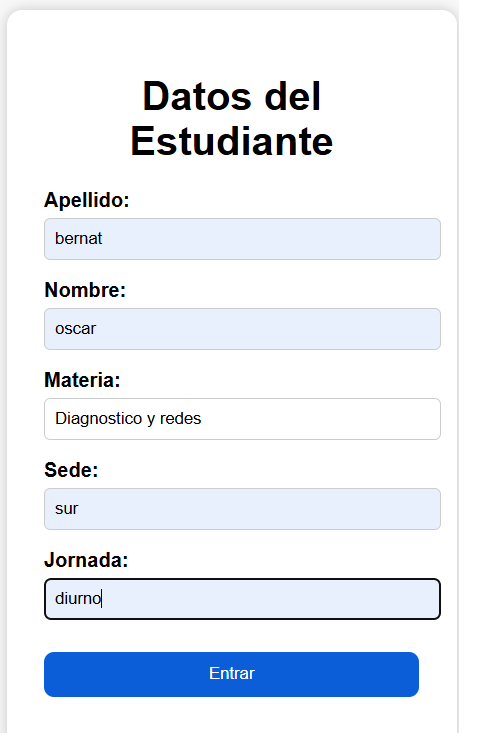
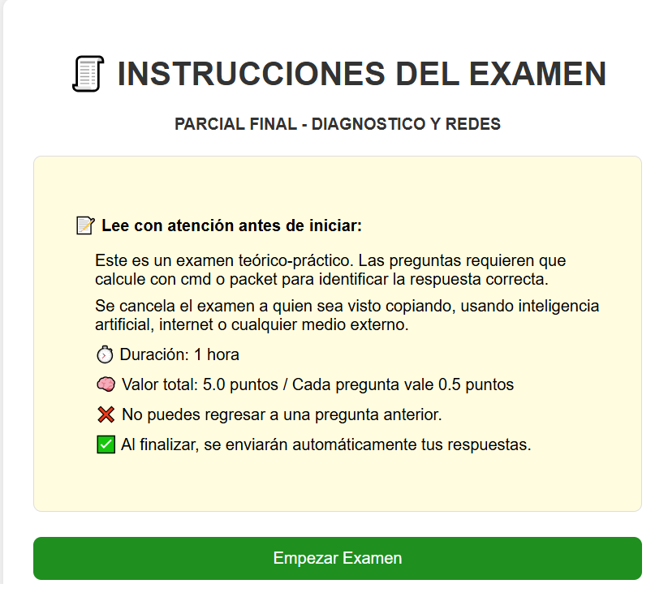
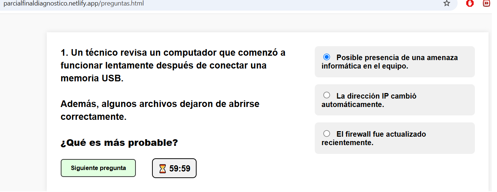
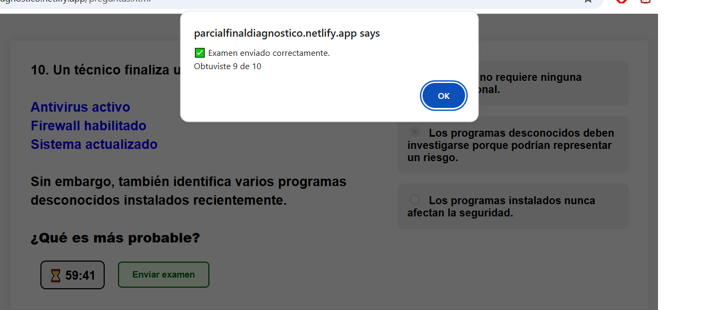
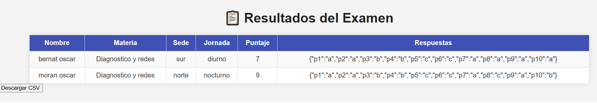
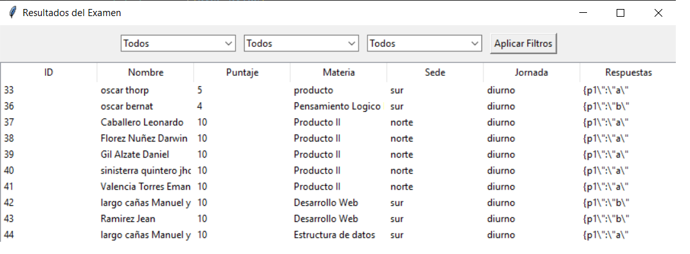

# Online Exam System
## Description

Web-based quiz system for academic assessment.
The system allows students to enter their personal data, read instructions before starting the exam, answer multiple-choice questions, and automatically receive a final score once the exam is completed.
It calculates results in real time (e.g., 8/10 correct answers), stores the results in a database, and allows administrators to review and export them.
It includes a Node.js backend for data persistence and an additional admin module for result management.

## Technologies used

- HTML
- CSS
- JavaScript
- Node.js
- Express
- SQLite
- Python (administration module)
- Modular architecture (frontend, backend, admin)

## Project structure
```
Examenes/
│
├── admin/
│   ├── admin_vista.py
│   ├── index.html
│   ├── script.js
│   ├── style.css
│   ├── respuestas.csv
│   └── resultados_local.db
│
├── backend/
│   ├── conexion.js
│   ├── server.js
│   ├── package.json
│   ├── package-lock.json
│   │
│   ├── dao/
│   │   └── respuestasDAO.js
│   │
│   ├── db/
│   │   ├── resultados.db
│   │   └── .gitkeep
│   │
│   └── node_modules/
│
├── materia/
│   ├── index.html
│   ├── instrucciones.html
│   ├── preguntas.html
│   │
│   ├── css/
│   │   ├── style-datos.css
│   │   ├── style-instrucciones.css
│   │   └── style-preguntas.css
│   │
│   ├── js/
│   │   ├── script-datos.js
│   │   └── script-preguntas.js
│
└── evidencias/
```
## Technical explanation

The system was developed as a modular web-based exam platform with separation between frontend, backend, and administration layers.

The project follows a clear layered architecture:

- **Frontend (materia):** contains the student interface for entering personal data, reading instructions, and answering multiple-choice exam questions.
- **Backend (Node.js):** handles request processing, evaluation logic, and data persistence using SQLite through a DAO layer.
- **DAO (Data Access Object):** manages all database operations, including saving and retrieving exam results.
- **Database:** stores all exam results and student submissions using SQLite.
- **Admin:** provides a management interface to view results, export data to CSV, and consult stored records.

The system flow is:

1. The student enters personal data in the initial form.
2. The student reads the instructions.
3. The student answers multiple-choice questions.
4. The system evaluates answers automatically.
5. A final score is generated (e.g., 8/10).
6. Results are sent to the backend and stored in the database.
7. The administrator reviews and exports results.

## Evidence

!





